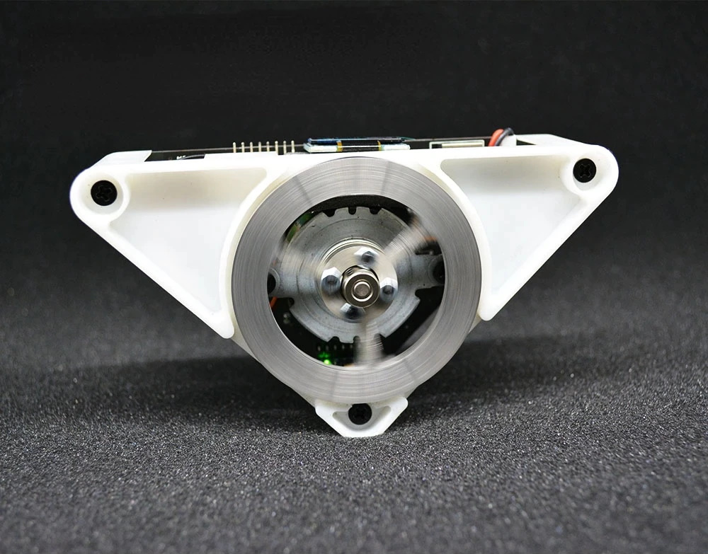

# pid-balancetriangle
Code and notes for a PID-controlled self-balancing triangle, such as available at https://www.aliexpress.com/item/1005003676839138.html

## Operation
- Press both buttons to enter setup mode.
- Press S1 while tilting the triangle left/right to decrease/increase energy store
- Press S2 while tilting the triangle left/right to decrease/increase Cen_SET
- Press both buttons again to save parameters

## Modifying the Software
While the above describes the operation of the triangle as supplied, the main attraction for me was the fact that the source code of the controller could be reprogrammed. It uses an STM32F103C6 board based on an ARM processor, somewhat similar to an Arduino/ESP, except designed more for industrial control. 

### Using Keil
The source code comes supplied as a Keil project, so to compile and upload the supplied code to the board, you will need:
- The [Keil MDK and uVision IDE](https://www.keil.com/demo/eval/arm.htm) - you will need to register with an email address to access the download (current v5.36, 912Mb)
- [ST-Link](https://www.ebay.co.uk/itm/313809775705) - a USB dongle that acts as a debugger and uploader to the STM32 board
- The [ST-Link Driver](https://www.st.com/content/st_com/en/products/development-tools/software-development-tools/stm32-software-development-tools/stm32-utilities/stsw-link009.html#get-software) for the above (current v.2.0.2, 5Mb)

### Code
1. Open the Keil project triangle.uvprojx from the project\USER directory in Keil uVision v5
2. Make changes to source code as required:
 - USER\main.c contains high-level program loop
 - BALANCE\control.c contains PID control code, key handling etc.
 - BALANCE\show.c contains OLED display code
3. To configure for target device, Under Project -> Options for Target 1
 - Device Tab: STM32F103C6
 - Output Tab: Select folder for objects as \OBJ
4. Build by selecting Project - Build Target 
5. To upload to the device, connect an STLink USB dongle to the triangle, with 3.3V, GND, DIO and CLK.
6. Then load STM32CubeProgrammer, Connect to the device, select the .hex file compiled by Keil, and then upload.

